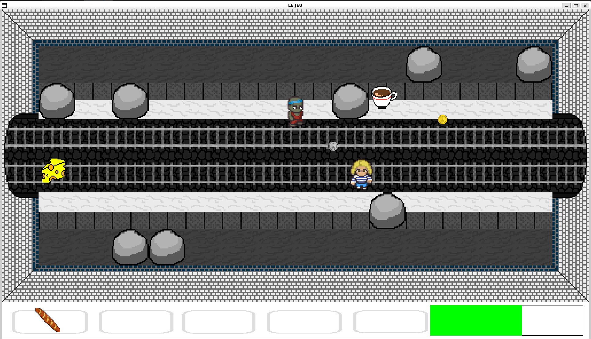

# Distolympi
Dans le cadre de notre **Projet Pluridisciplinaire d'Informatique Intégrative n°2** à Télécom Nancy, nous avons décidé (groupe de 4 élèves) de créer de toute pièce un Hack'n'Slash.

## Histoire
Les Jeux Olympiques de Paris 2024 ont tourné au cauchemar. Les nageurs les plus courageux ayant osé nager dans les eaux polluées de la Seine se sont vu contaminer par un étrange virus. Un virus qui laisse penser que la Covid-19 n'était rien à côté.

Loli armée de son courage mais surtout de sa marinière bien française devra explorer les profondeurs du métro parisien tout en affrontant les hordes de zombies.

Le sort de Paris est entre les mains de Loli (ou plutôt juste sa vie mais c'est déjà pas mal), saura-t-elle faire face à cette menace.

Bonne chance, car elle en aura besoin (et aussi d'une baguette et de fromage).

  

## Gameplay
Le jeu est assez simple à prendre en main mais dur à maitriser.

Vous vous déplacez avec les touches classiques : Z, Q, S et D. Vous pouvez attaquer avec la touche espace et viser avec la souris. Et enfin vous pouvez ramasser des objets avec la touche E.

Pour utiliser les objets présents dans votre inventaire, il vous suffit d'utiliser la touche avec le numéro correspondant, 1 pour le premier, 2 pour le deuxième, etc.

Le but du jeu est de survivre le plus longtemps cela implique de tuer le plus de zombies possible. Chaque fois que vous avez tué tous les zombies d'une salle vous pouvez passer à la suivante mais gare à votre barre de vie, elle pourrait descendre plus vite que vous ne le pensez.

## Quelques détails techniques
Parlons un peu des ennemis. Il en existe de deux types : les zombies au corps-à-corps (c'est les torses nus) et ceux à distance (c'est ceux avec un débardeur).

Ces deux types de zombies partagent le même pathfinding. Celui-ci se fonde sur un algorithme de Dijkstra appliqué à un graphe où chaque sommet est une tile de la salle actuelle et les arêtes étant les tiles entre lesquelles le zombie peut passer, typiquement les obstacles sont des sommets isolés.

Un autre point qui peut être abordé est la gestion des médailles que les zombies à distance tirent. Chaque zombie a dans sa structure une liste chaînée (simplement) qui contient toutes les médailles qu'il a tirées et qui sont encore présentes sur la carte. Cette structure permet de gérer assez facilement l'ajout et le retrait d'une médaille tout en ayant une taille dynamique.
